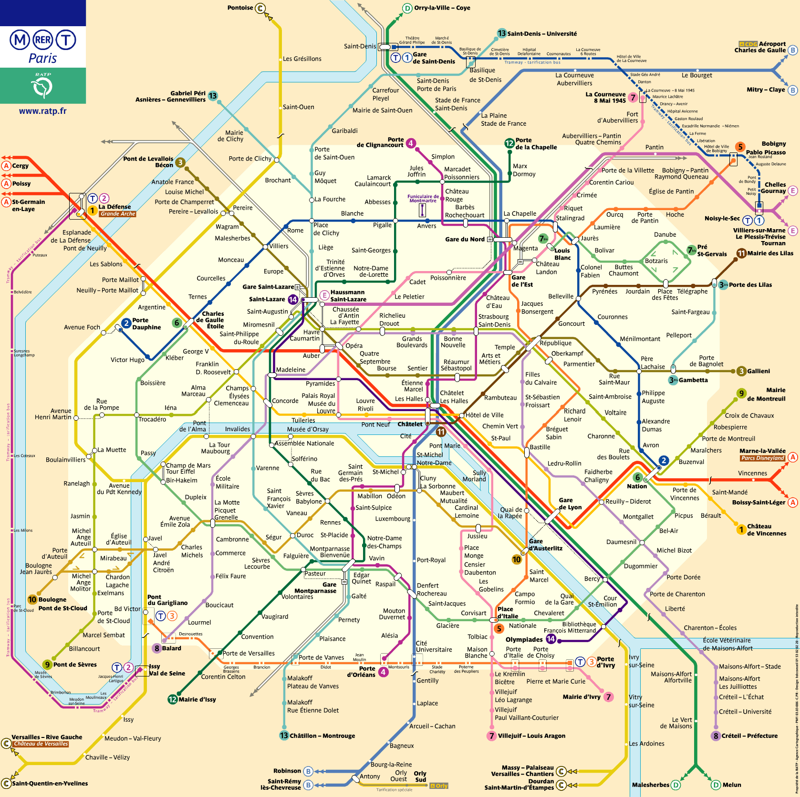

# Trabalho Prático de Projeto e Análise de Algoritimos

Este trabalho explora a aplicação de diferentes técnicas de projeto de algoritmos para solucionar dois problemas de otimização inspirados em um desafio logístico do metrô de Paris. O projeto envolve modelagem do sistema de metrô como um grafo, implementação de algoritmos e visualização dos resultados em uma interface gráfica.

## Problema 1: O Tour Perfeito (Ciclo Simples Mais Longo)

Como maximizar a experiência de um turista? O objetivo é encontrar o roteiro que começa e termina em uma mesma estação, visitando o maior número possível de estações distintas sem revisitar nenhuma (exceto o retorno à origem).

**Definição Formal:** Seja $G(V,E)$ um grafo não direcionado, onde $V$ é o conjunto de estações e $E$ é o conjunto de conexões. Um **ciclo simples** $C$ é uma sequência de vértices distintos $(v_1, v_2, \dots, v_k)$ tal que $(v_i, v_{i+1}) \in E$ para todo $i \in \{1, \dots, k-1\}$ e $(v_k, v_1) \in E$. O objetivo é encontrar um conjunto de ciclo simples $C^*$ cujo sua cardinalidade $|C^*|$ seja máximo. Formalmente, encontrar:

$$C^* = \arg\max_{C \subseteq V} \{|C| \mid C \text{ é um ciclo simples em } G\}$$

O valor a ser retornado é o comprimento $|C^*|$.

## Problema 2: Cobertura Eficiente (Conjunto Dominante Mínimo)

Onde instalar guichês de venda de passes para garantir máxima conveniência com o mínimo de custo? O objetivo é determinar o menor número de estações para instalar guichês, de forma que qualquer estação do sistema esteja a, no máximo, uma conexão de distância de um guichê.

**Definição Formal:** Seja $G(V,E)$ um grafo não direcionado, o objetivo é encontrar um **conjunto dominante** de tamanho mínimo. Um subconjunto de vértices $S \subseteq V$ é dito um conjunto dominante se, para todo vértice $v \in V$, ou $v$ pertence a $S$, ou $v$ é adjacente a pelo menos um vértice em $S$.

Mais formalmente, $S$ é um conjunto dominante se para todo vértice $v \in V \setminus S$, existe um vértice $u \in S$ tal que $(u,v) \in E$. O objetivo é encontrar um conjunto dominante $S^*$ cujo tamanho $|S^*|$ seja mínimo. Formalmente, encontrar:

$$S^* = \arg\min_{S \subseteq V} \{|S| \mid \forall v \in V, (N[v] \cap S) \neq \emptyset \}$$

Onde $N[v] = \{v\} \cup \{u \in V \mid (v,u) \in E\}$ é a vizinhança fechada do vértice $v$. O valor a ser retornado é a cardinalidade $|S^*|$.

### Problema 1: O Tour Perfeito (Ciclo Simples Mais Longo)

Como maximizar a experiência de um turista? O objetivo é encontrar o roteiro que começa e termina em uma mesma estação, visitando o maior número possível de estações distintas sem revisitar nenhuma (exceto o retorno à origem).

**Definição Formal:** Seja $G(V,E)$ um grafo não direcionado, encontrar $$

### Problema 2: Cobertura Eficiente (Conjunto Dominante Mínimo)

Onde instalar guichês de venda de passes para garantir máxima conveniência com o mínimo de custo? O objetivo é determinar o menor número de estações para instalar guichês, de forma que qualquer estação do sistema esteja a, no máximo, uma conexão de distância de um guichê.

**Definição Formal:** Seja $G(V,E)$ um grafo não direcionado, encontrar $$

## Técnicas de Projeto de Algoritmos Abordadas

Para cada desafio, foram implementadas e comparadas três soluções distintas, representando diferentes trade-offs entre tempo de execução e otimalidade do resultado.

* **Força Bruta:** Uma busca exaustiva que testa todas as possibilidades. Garante a solução ótima, mas possui um custo computacional proibitivo para grafos grandes.

* **Branch-and-Bound:** Uma técnica de otimização que explora a árvore de busca de forma inteligente. Utilizando funções de limite (bounds), ela "poda" ramos que não levarão a uma solução melhor que a já encontrada, reduzindo significativamente o espaço de busca em comparação com a força bruta.

* **Heurística (Solução Aproximada):** Um algoritmo projetado para encontrar uma solução de alta qualidade em tempo polinomial. Embora não garanta a otimalidade, é fundamental para obter respostas rápidas em instâncias complexas e de grande escala, onde métodos exatos são inviáveis.

Consulte [`artigo.pdf`](./artigo.pdf) e [`Main.java`](./Main.java) para mais detalhes sobre os algoritimos codificados.

## [Imagem base do metrô de Paris](./plano-metro-paris.png)

## Estrutura do Repositório

* [`trab.pdf`](./trab.pdf): Enunciado original do trabalho prático.
* [`artigo.pdf`](./artigo.pdf): Artigo científico detalhando a metodologia, implementação e resultados do projeto.
* [`Main.java`](./Main.java): Todo o código fonte implementado com a interface gráfica e a solução dos dois problemas usando as técnicas de projeto apresentadas.
* [`n2_stations.txt`](./n2_stations.txt): Arquivo de entrada com as estações do metrô (os vértices do grafo).
* [`n2_lines.txt`](./n2_lines.txt): Arquivo de entrada com as linhas do metrô (as arestas do grafo).
* [`tests`](./tests/): Diretório que armazena os arquivos usados nos testes de implementação dos algoritmos.

## Colaboradores
|  |  |  |  |
|:---:|:---:|:---:|:---:|
| [Thomas   Neuenschwander](https://github.com/thomneuenschwander) | [Henrique   Lara](https://github.com/henriquerlara) | [Eduardo   Araújo](https://github.com/EduardoAVS) | [Luigi   Louback](https://github.com/LuigiLouback) |
